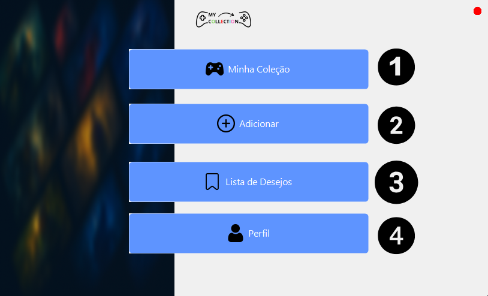
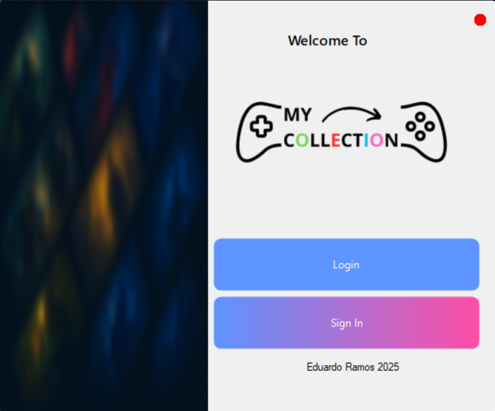

# 🎮 My Collection

Aplicação desenvolvida em Windows Forms que permite aos utilizadores gerir a sua coleção de videojogos e uma wishlist com jogos que pretendem adquirir futuramente.

---

## 📌 Funcionalidades

- 👤 Registo e login de utilizadores
- 🗃️ Adição, edição e remoção de jogos na coleção
- ⭐ Gestão separada da wishlist
- 📷 Suporte para imagens dos jogos
- 🔐 Validação de links e dados

---

## 🖼️ Interface

  
  

---

## 🧰 Tecnologias utilizadas

- 💻 **C#** – linguagem de programação principal
- 🎨 **Guna UI2** – biblioteca de componentes visuais modernos
- 🗃️ **SQL Server LocalDB** – base de dados local
- 🧱 **Windows Forms** – interface da aplicação
- 🧠 **.NET Framework 4.0**
